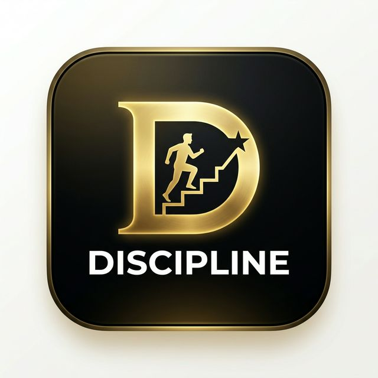

# Discipline Habit Tracker

A sleek and powerful habit tracking application designed to help you stay disciplined and reach your goals.

<p align="center">
  
</p>

## 🚀 Features

- **Daily Habit Tracking**: Monitor your progress every day with a clean interface.
- **Progress Visualizations**: See your growth over time with beautiful charts and statistics.
- **Categorized Goals**: Organize your habits into different areas of life such as Study, Business, and Health.
- **Mobile Responsive**: Built with a mobile-first approach for tracking on the go.
- **Premium Design**: Modern aesthetics with glassmorphism and smooth animations.

## 🛠️ Tech Stack

- **React** + **TypeScript**
- **Vite** (Build Tool)
- **Tailwind CSS** (Styling)
- **Zustand** (State Management)
- **Lucide React** (Icons)

## 🏁 Getting Started

### Prerequisites

- Node.js (v18 or higher)
- npm or yarn

### Installation

1. **Clone the repository**
   ```bash
   git clone <repository-url>
   ```

2. **Install dependencies**
   ```bash
   npm install
   ```

3. **Start the development server**
   ```bash
   npm run dev
   ```

## 📄 License

This project is licensed under the MIT License - see the [LICENSE](LICENSE) file for details.
